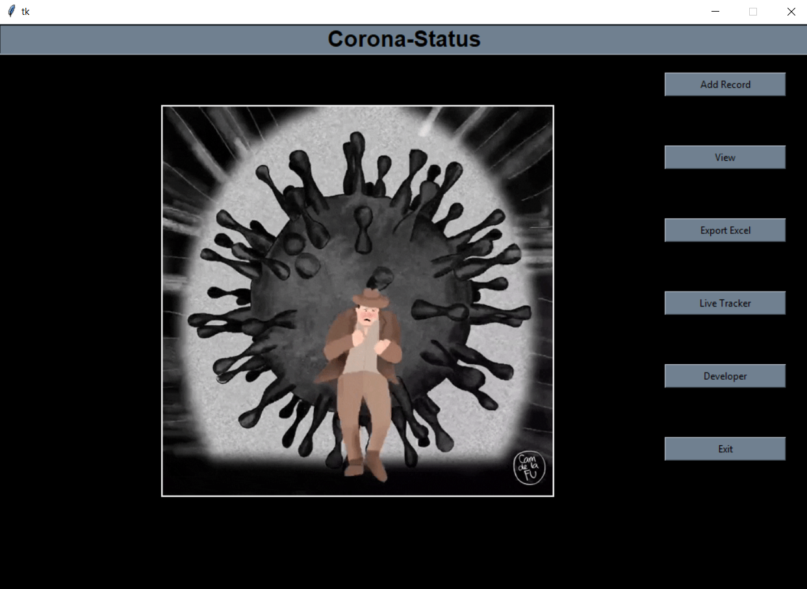
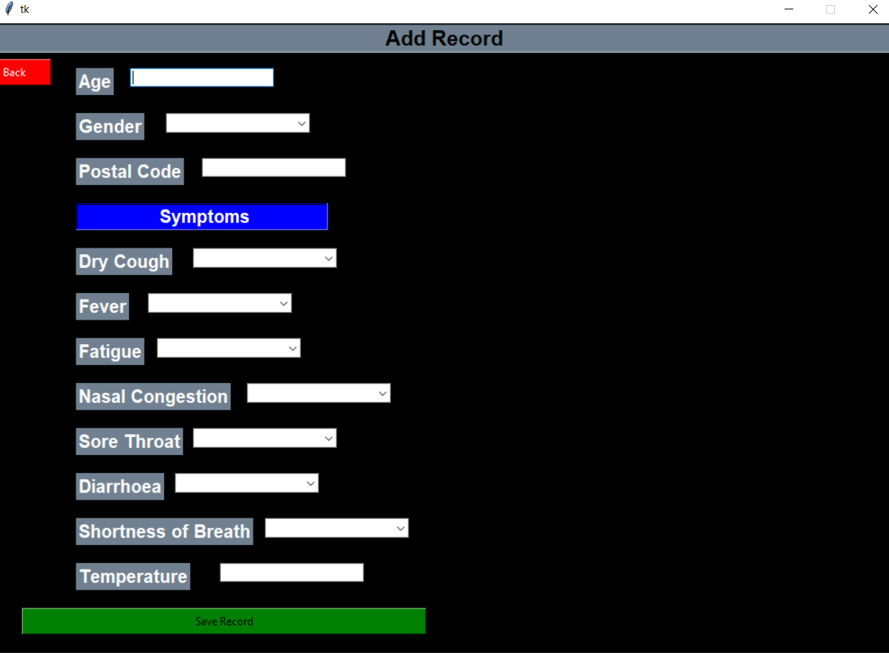
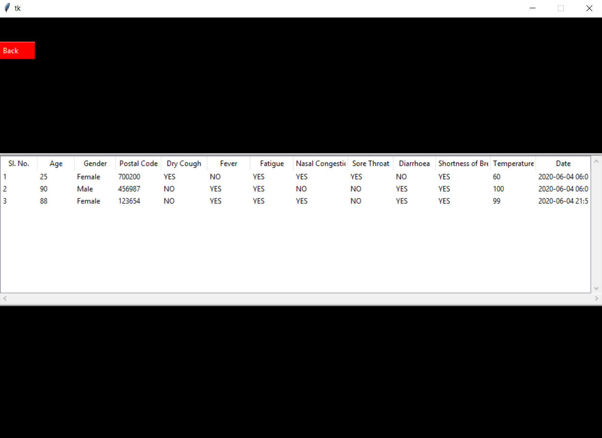
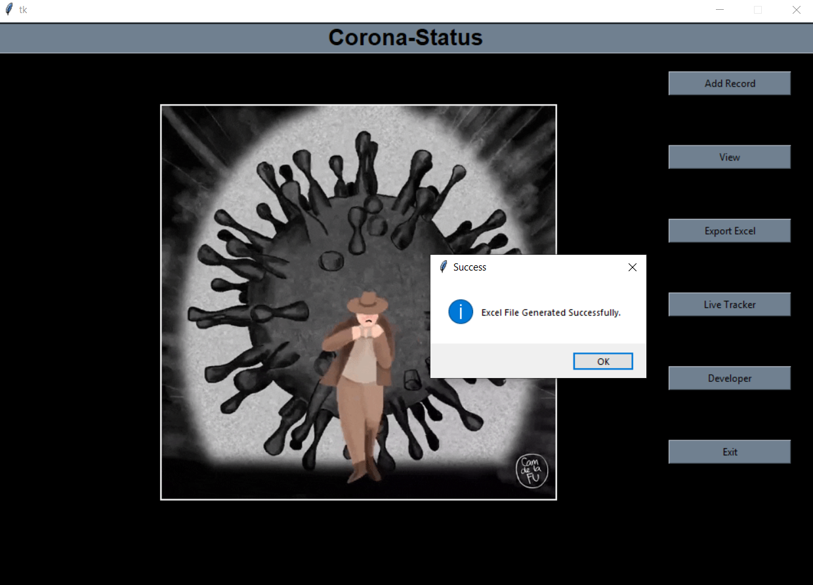
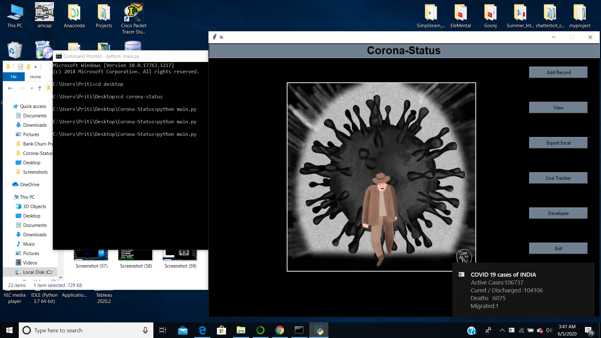
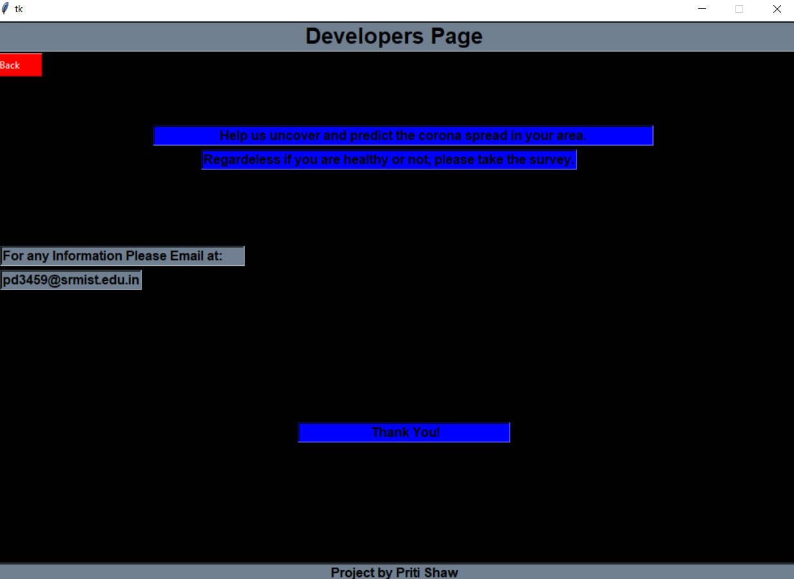

# Corona-Status

1. Download the folder named Corona-Status, open the terminal and add a path to it.
2. Install the following Python packages
a. Tkinter
b. Sqlite3
c. Pillow
d. Xlsxwriter
e. Requests
f. Beautiful Soup
g. Plyer
3. Execute "python main.py", in the terminal to run the app.

